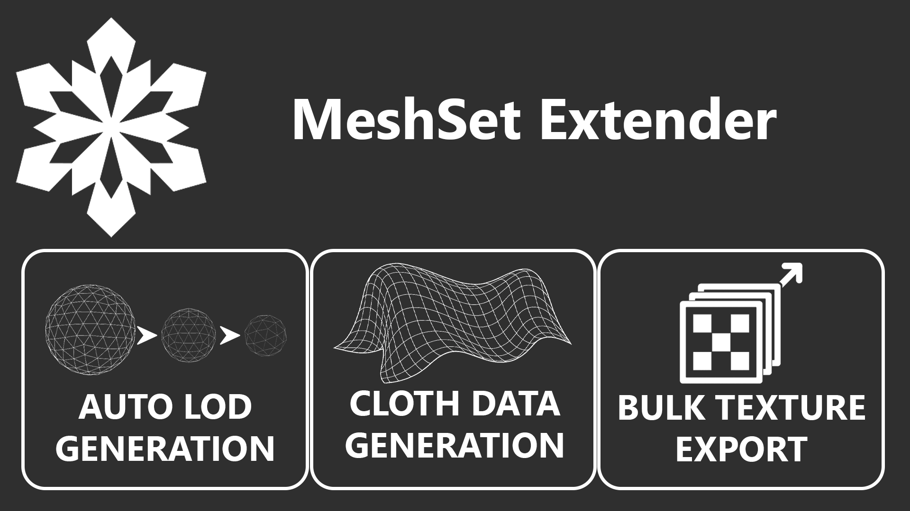

# Frosty MeshSet Extender

-blue?style=for-the-badge)

A Frosty Editor plugin that provides texture exporting, automatic LOD generation, and cloth data generation — all in one package.

## Features

### 1. MeshSet Exporter

Export mesh resources, chunks, and textures directly from Frosty Editor without needing the Chunk/Res Explorer.

**What it does:**
- Adds "Export Mesh Res/Chunk Files" context menu item (right-click MeshAsset)
- Adds "Export Res/Chunk Files" and "Export Textures" buttons to the mesh editor toolbar
- Exports all associated .res files, .chunk files, and texture files

**How to use:**
1. Right-click a **Mesh** asset → Select **Export Mesh Res Files**
2. Or open a mesh in the editor → Click **Export Res Files** or **Export Textures** on the toolbar
3. Choose your format (texture export only)
4. Choose a destination folder

### 2. Auto LOD Generator

Automatic LOD generation for Frostbite meshes directly inside Frosty Editor.

**What it does:**
- Keeps **LOD0** untouched (your full-quality mesh)
- Automatically generates **LOD1–LOD5** during import
- Reduces triangle counts safely using meshoptimizer
- Preserves vertex layout, normals, UVs, skin weights, and section structure

**How to use:**

#### Single Mesh Import
1. Right-click a **Mesh** asset → Select **Import FBX (Auto LOD)**
2. Choose your FBX file
3. Confirm quality settings

#### Folder Batch Import
1. Right-click any **folder** in the Data Explorer tree
2. Select **Import Folder (Auto LOD)** or **Import Folder + Subfolders (Auto LOD)**
3. Assign FBX files to each mesh asset
4. Click Import

#### Quality Settings
- **Conservative**: 70%, 50%, 35%, 20%, 10% triangle retention
- **Balanced**: 50%, 25%, 12.5%, 6.25%, 3% triangle retention (default)
- **Aggressive**: 35%, 15%, 6%, 3%, 1.5% triangle retention
- **Custom**: Set your own ratios per LOD

### 3. Cloth Data Generator

Generate cloth simulation data for meshes by copying from template meshes that already have cloth data.

**What it does:**
- Copies ClothWrappingAsset and EACloth from a template mesh to a target mesh
- Adapts vertex positions, normals, tangents, and bone weights to the target mesh
- Supports multi-LOD cloth data adaptation

**How to use:**
1. Right-click a **SkinnedMeshAsset** → Select **Generate Cloth Data**
3. The target mesh is auto-loaded from your selection
4. Click **Browse Mesh...** to select a template mesh that has cloth data
5. Adjust precision and settings as needed
6. Click **Generate**

## Installation

1. Download the latest release.
2. Place `MeshSetExtender.dll` into your Frosty Editor `Plugins\` folder.
3. Launch Frosty Editor.

That's it. All three features activate automatically.

## Requirements

- Frosty Editor (x64)
- .NET Framework 4.8

`meshoptimizer.dll` is bundled and automatically handled, no manual setup needed.

## Known Limitations

- Extremely small meshes may not simplify further (Auto LOD)
- Vertex collapsing is not used — index-only approach for safety (Auto LOD)

## Credits

- meshoptimizer by zeux

## License

Creative Commons Attribution-NoDerivatives 4.0 International (CC BY-ND 4.0)

You are free to:

Share, copy and redistribute the material in any medium or format, for any purpose, even commercially.

Under the following terms:

Attribution — You must give appropriate credit, provide a link to the license, and indicate if changes were made.
NoDerivatives — If you remix, transform, or build upon the material, you may not distribute the modified material.

## Support

If you encounter issues:
- Open a GitHub issue
- Include your Frosty logs (enable debug logging)
- Include mesh details if possible
- Discord: syntaxspecter